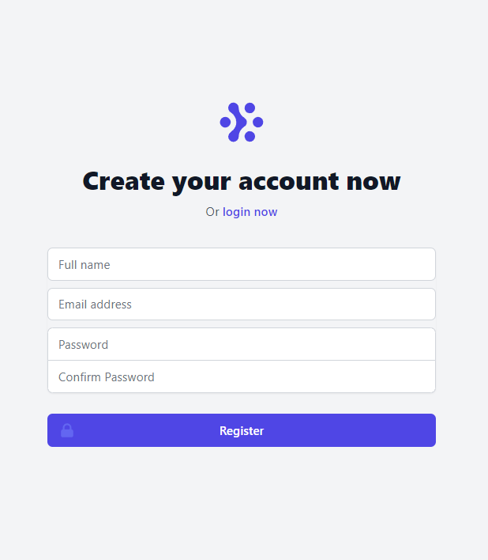

# Verses
This application is a Bible Tracking app that allows you to track your reading progress of the bible. It allows you to add daily reading records and creates a stats page of different stats such as your percentage through the whole bible, your progress of the old & new testament as well as a month by month bar chart so you can see your progress over time.

The application is now live at: [http://stark-shelf-50242.herokuapp.com/](http://stark-shelf-50242.herokuapp.com/)

## Technologies
The application is built using Node.js using the express.js framework. The UI using Tailwind Css & Alpine JS as well as EJS (Embedded Javascript) Templates. The database for the application is MongoDB and is connected to via Mongoose.

The application uses an MVC design with 2 types of controllers. Normal controllers which return a view with data and api controllers which return only JSON objects in order to allow AJAX on some of the pages.

## Run the application
In order to run the application, run:

`npm install` and then `npm run dev-purge` (the purge command will make sure tailwind css has the correct css in its output file).

# Screenshots

