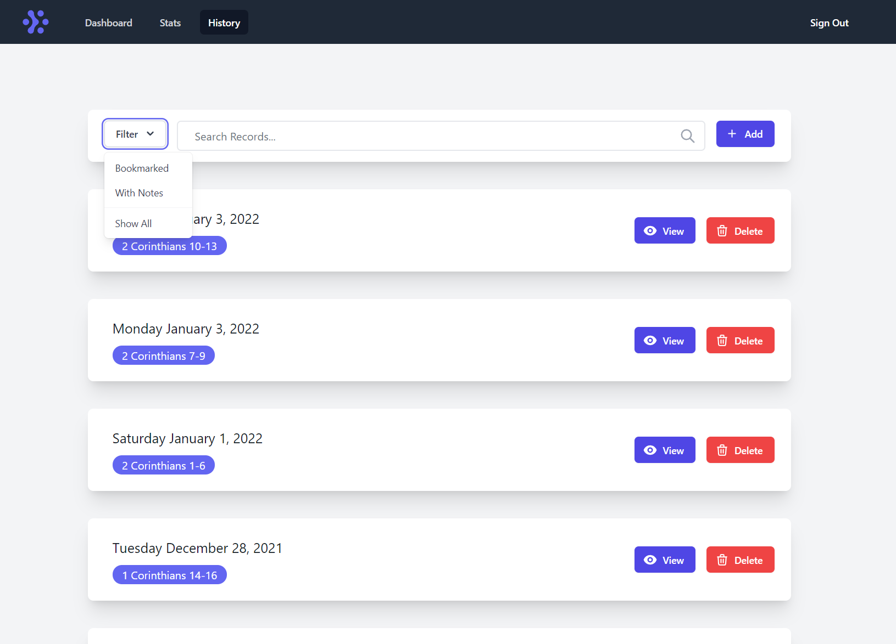

# Verses
This application is a Bible Tracking app that allows you to track your reading progress of the bible. It allows you to add daily reading records and creates a stats page of different stats such as your percentage through the whole bible, your progress of the old & new testament as well as a month by month bar chart so you can see your progress over time.

The application is now live at: [http://verses-eu.herokuapp.com/](http://verses-eu.herokuapp.com/)  
The application landing page for beta signups is available at: [http://versesapp.duckdns.org/](http://versesapp.duckdns.org/) | [(Repo)](https://github.com/RyanGaudion/Verses-Landing)


## Technologies
The application is built using Node.js using the express.js framework. The UI using Tailwind Css & Alpine JS as well as EJS (Embedded Javascript) Templates. The database for the application is MongoDB and is connected to via Mongoose.

The application uses an MVC design with 2 types of controllers. Normal controllers which return a view with data and api controllers which return only JSON objects in order to allow AJAX on some of the pages.

## Run the application
In order to run the application for development run the following commands. (Dev differs from production by the fact it sets up a TailwindCSS watcher, meaning any changes to the UI will automatically update the output Tailwind CSS file):

 - `npm install` and then `npm run dev` 
 
In order to run production locally, use:

- `npm install` and then `npm run prod`

Finally used by Heroku:
- `npm run start`

### Example .env
In order for the application to run an environment file needs to be created (`.env`). An example of which can be seen below:

```
PORT=8080
MONGODB_URI=mongodb+srv://user:server/db?options
MONGODB_PRODUCTION_URI=mongodb+srv://user:server/db?options
```

# Screenshots





