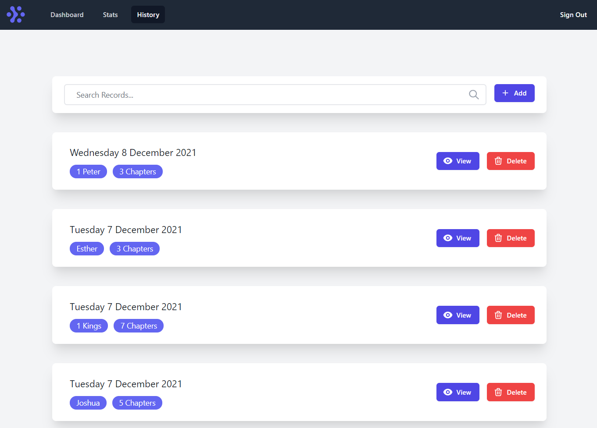
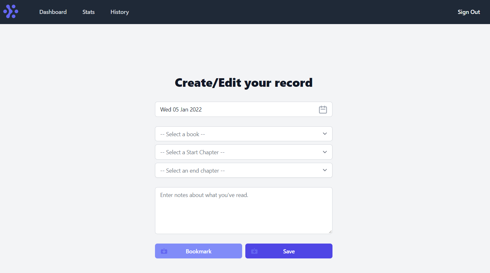
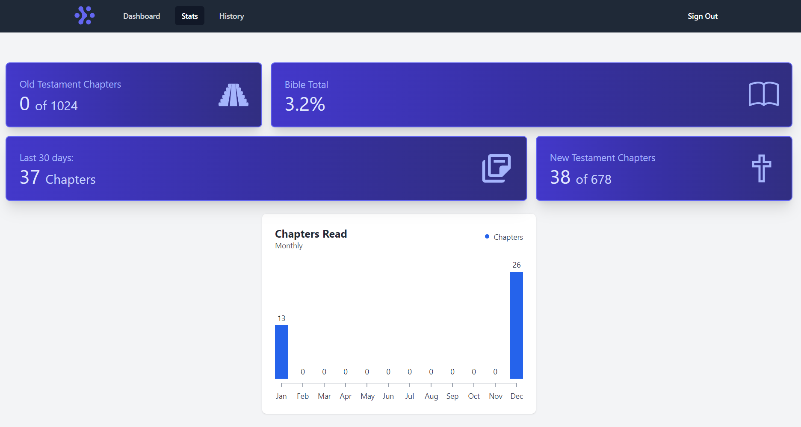
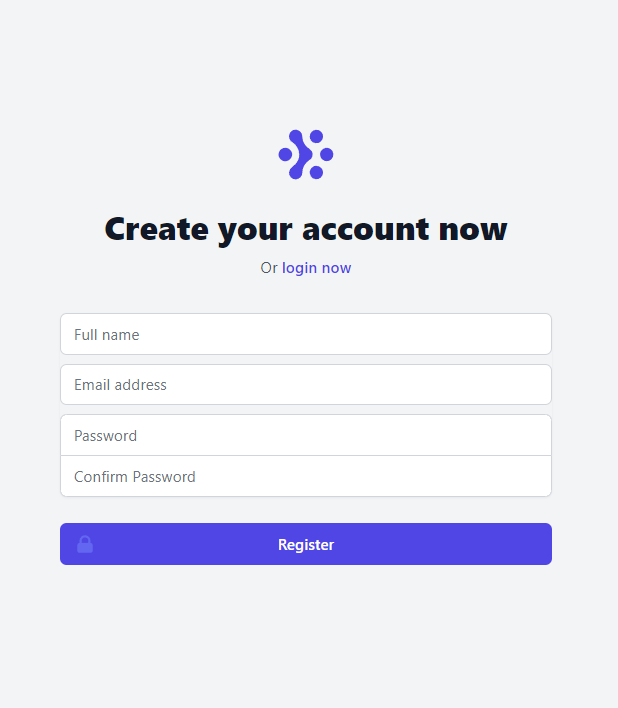
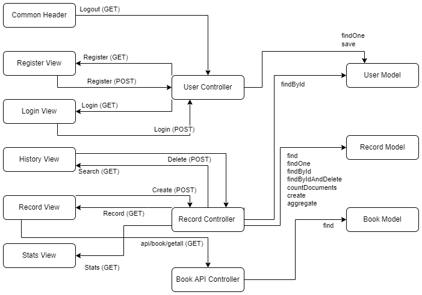
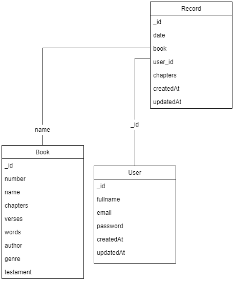
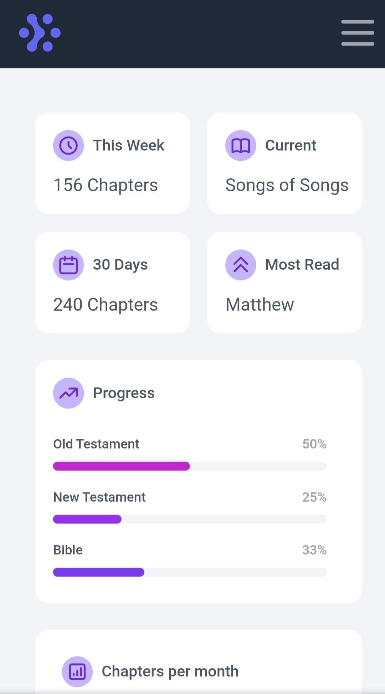
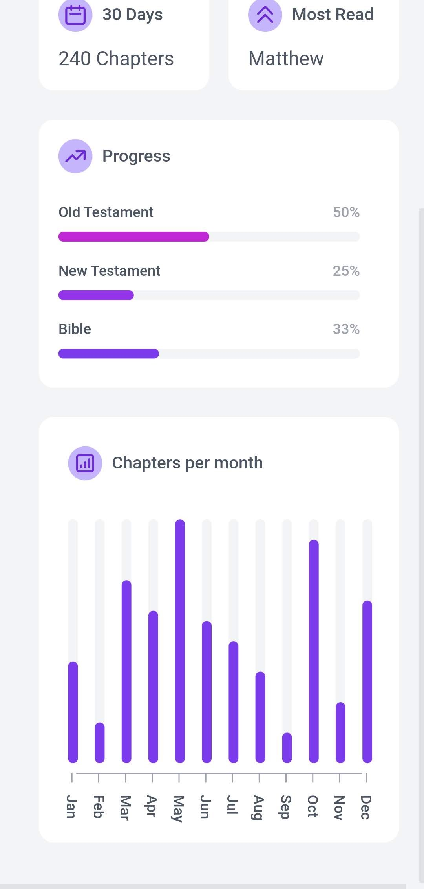

# Verses Web Application
Hosted Application: http://verses-eu.herokuapp.com/  
Repository: https://github.com/RyanGaudion/Verses-Node

# Introduction
As a Christian, the Bible is the most important book ever written. We believe the words within it are breathed from God himself. However, the Bible is a huge collection of 66 books split between the Old & New Testament amounting to 783,137 words.`(1)`  For context, this is over 6 times larger than the 122,189 words of Pride & Prejudice.  

In addition to this, the Bible does not have to be read chronologically, making it difficult to keep track which parts of it you have read.

My application provides a way to keep track of your progress through the Bible and also provides statistics on your reading habits in order to assist you in reading the entire Bible.

# System Overview
This application is built with an MVC (Model, View, Controller) architecture, using Node.js for the backend, connecting to a MongoDB database while using EJS, Tailwind CSS & AlpineJS for the views. The reason for using Node.js alongside Express.js is its ability to run JavaScript on the server-side rather than in the frontend browser. The Node.JS stack allows quick iterations of code and faster development work due to the fact it uses JavaScript which is an interpreted language. This allows me to change code and quickly see its effect without having to wait for the code to compile.

The reason I chose the MVC architecture for the application is due to the fact it is a well proven architecture that has been used for thousands of production applications. It provides easier maintainability and expansion of the codebase through the loose coupling between the Models, Views & Controllers.  

The reason for using a non-relational database like MongoDB was due to the read & write simplicity it provides as well as the performance benefits too `(5)` One downside of non-relational & NoSQL databases is data integrity however this application does not require high data consistency making MongoDB a perfect choice.

The benefits of Tailwind CSS (a CSS Utility Framework) & AlpineJS (A lightweight framework for adding UI behaviour) is the performance they provide as well as the huge amount of code that they abstract away. They allow me to quickly iterate my design without having to spend hours writing lots of UI code. The performance benefits are outstanding too, rating my website 100/100 on Google Lighthouse tests which is as a result of their small size. Alpine JS is 15kb and TailwindCSS is 30kb which combined is smaller than BoostrapCSS on its own (58kb) `(4)`.

There are 2 main parts of the application, the reading history & the stats:

## History
The History Page shows a list of all records that have been entered into the system. This page is paginated using `skip` and `limit` from Mongoose. The use of pagination means that not all records have to be loaded from the database at once - allowing the page to load much faster.

It also provides the ability to filter the page to records that are bookmarked or records that have notes. This is selected via a dropdown which in the backend executes one of 3 Mongoose queries each with unique filters. This page also has the ability of full text search through records, which works by setting up a full text index on the Record Model to search against. This allows the user to easily find records with a specific word in their notes.

From this page you have the ability to "view" and "delete" each record. The view button opens a pre-populated Record Page which allows values to be updated. The delete button shows a confirmation popup and then uses Mongoose to delete the record. Finally, this page provides an "Add" button to insert a new record.



### Record

The Record Page is accessible either by adding a new record or editing an existing reading record. This page includes 5 fields, 'Date', 'Book', 'Start Chapter', 'End Chapter' and 'Notes'.

The Date field produces a custom Date picker which was created using AlpineJS and Tailwind CSS.  
In order for the user to enter the Book of the Bible, as well as the Start & End Chapter, I could have allowed free text entry. However, running any type of statistics on this would be difficult. 

Due to the fact the Bible is immutable, the range of values for books & chapters are fixed values that never change. Hence, within my database seeder I pre-populate the database with the names & sizes of each of the book of the Bible. I then created an API endpoint `/api/book/getall` which returns all this information in JSON. From my Record Page, I then used AlpineJS to create a custom component for selecting the Book, Start Chapter & End Chapter. This component uses the JavaScript "Fetch" method (similar to jQuery.ajax()) in order to fetch the API data without having to reload the page resulting in quicker page load times.

Finally, this page has 2 buttons "Bookmark/Unbookmark" and "Save". This allows the user to bookmark certain records which they found interesting/useful. These records can then be found via the "Bookmarked" filter on the History Page. In the backend this simply works by storing a bookmarked boolean on the Record Model. 



## Stats

The Stats Page is split into 2 main sections, quick statistics (which provide short summaries such as how many chapters have been read in the last 30 days, or what percentage of the Bible is complete) and the monthly graph (which shows in a chart how many chapters have been read per month for the last year).

These statistics are calculated using multiple complex MongoDB aggregation pipelines and are then displayed on screen via EJS. The graph provides data visualisation for the user to easily see their current reading habit vs previous months. This also uses aggregation for its data as well as AlpineJS and TailwindCSS for the graph's UI. The reason I chose to use aggregation pipelines for statistic calculations is due to their high performance on realtime data. As an alternative I could have re-calculated statistics on every new record being added to the database however this would not only reduce write performance but would also increase the size of the database.



## User
The user can create an account via the Register Page and then sign in to their account via the Login Page.  

The user's password is not stored in the database directly, but instead uses a database model pre-hook & BCrypt in order to hash the password before it is stored in the database.  

The signed in user is associated to their account via a user session which allows the application to know the current user from within every controller.



Below is a system diagram to see how each layer of the MVC application works together:



# Key Design Decisions

## Database Design
This application consists of a Production and a Development MongoDB database located in MongoDb Atlas. Each of the databases have the following 3 collections:
 - Books
 - Records
 - Users

### Books 
The books collection stores information about each book in the bible. This information is populated via the seeder using the BooksOfTheBible.json data set.

An example value from this collection can be seen below:
```
_id : 619fa98ga6c8a62d28930afd
number : 1
name : "Genesis"
chapters : 50
verses : 1533
words : 38262
author : "Moses"
genre : "Law"
testament : "OT"
```

Currently only `number`, `name`, `chapters` and `testament` are being used, however I included the others values as they would be able to be used in a future version to provide more value to the user. Either via additional statistics or via additional features such as displaying book information.

### Records
The records collection is used in order to store each individual reading record of a user. It contains all the information required about that record such as the date, book, start & end chapters as well as notes. An example value from this collection can be seen below:

```
_id : 619fb85e5a57cd2936e34d08
date : 2021-11-24T00:00:00.000+00:00
book : "Luke"
user_id : 619fb7305a37cd2936e64cf8
chapters : [
    5, 6, 7, 8
]
createdAt : 2021-11-25T16:22:54.596+00:00
updatedAt : 2021-11-25T16:22:54.596+00:00
```

The record model has relationships to 2 other collections. First you can see `user_id` which contains the ObjectId of the user that created this record. This is used within the application in order to show the user only records that they created.

There also is a relationship from the record model to the book model which is linked via the name of the book. (In the example above this is "Luke"). This relationship is required for some of the aggregation pipelines used in the Stats Page, by linking a record to a book we can calculate what percentage of that book has been read by the user.

Finally to note, we store the chapters that the user has read as a single array of values, rather than a "start chapter" and an "end chapter" as seen in the UI. This is to allow additional features in the future where a user may want to select non-sequential chapters from a book.

### Users
The users collection stores the login information of each user, allowing reading records to be associated with a user. An example value from this collection can be seen below:

```
_id : 619f48dcb4c63a01ad9b8a4b
fullname : "Test User 1"
email : "test1@test.com"
password : "$2b$19$psQRbIpV0Uoc7lJhglVOWe8aapNGlOv5tk6paF6.5BDYO5.qzmHKe"
createdAt : 2021-11-25T08:27:08.488+00:00
updatedAt : 2021-11-25T08:27:08.488+00:00
```

Here we can see the hashed version of the password rather than a plaintext copy as well as the username of the user (their email address).

Here you can see a class diagram for each of the collections in the database and how they relate. Despite the fact this is a non-relational database, the class diagram is useful in order to visualise how different models are associated with each other.




## Security and Scalability

### Security
From a security point of view, the only private information that this application is holding would be the password of a user. In order to reduce the risk of holding this information I have made sure to only hold hashes of passwords. The hashing is done with BCrypt meaning salting of the password is included as well. Salting protects the password against Rainbow Table Attacks and makes sure even identical passwords give a unique output. Finally, BCrypt is a slow algorithm which is good for security as it increases the time it takes to brute force the password.

There are however many areas in which we could improve the security of the application. One area is by outsourcing the login & sign up process to a 3rd party such as Google or Facebook via OAuth or OpenId. This would eliminate all risk by no longer requiring my application to store user passwords. `(7)`

Another area of improvement would be for the application to support HTTPS instead of just HTTP which in turn would automatically encrypt traffic in motion to & from our server. The reason this is not enabled is simply due to a limitation of Heroku's free tier.

### Deployment & Scalability
The deployment of the application takes a DevOps approach by automatically building & releasing the application whenever a merge request is merged to the master branch. This allows for quick iterations of code which can then be tested quickly.

From a scalability point of view our application's MongoDB database is already scaled horizontally across 3 nodes within our EU deployment region using sharding.`(2)` Sharding increases throughput of our databases by distributing our data across multiple nodes. However, this is not the only type of scaling our database can do. If this application was to move to production, I would recommend that Cross-Region replication was enabled in order to provide data closer to customers internationally which in turn would increase performance. `(3)`

Another part of the application that would require scaling would be the Node.js application itself. Currently there is 1 instance of this available (hosted in Heroku) however in order to reduce load times for user's internationally, or allow more customers to visit the site, the application would need to scale. Horizontal scaling is usually cheaper however does raise one concern with the current architecture. If this application was to scale horizontally (across multiple instances) I would need a way to centralise user sessions so that every instance can access them. There are 2 ways this could be done, either by load balancing the instances (and have the load balancer store the sessions) or by storing the sessions in a database. 

One way to solve the scalability issue is to move to a serverless design. `(6)` This would mean re-architecturing the app to only include API endpoints. However, by doing this I could store the site itself as a static file (in something like an S3 bucket) and have the background logic run as serverless functions (for example AWS lambda). Both S3 buckets & serverless functions combined with MongoDB cross-region replication would provide not only a highly scalable application but also would reduce the cost per user drastically.

# Conclusion and Reflection
On reflection, this prototype application includes all the features I set out to include plus more (bookmarking & notes). It fulfills its original goal of allowing me to track my progress through the Bible.

This application is only a proof of concept and hence does have limitations, such as its usability on mobile devices. The application is not fully mobile responsive and shows strange UI behaviour on smaller devices.

To improve this application further I would generally improve the UI, including design consistency as well as mobile responsiveness. In order to do this, I have created a new branch in the GitHub Repository to work on the user interface. These changes won't be deployed with this prototype however you can see below a first draft of the redesigned UI.

From the application side there is also one improvement I would like to implement. Currently the search bar on the History Page only searches on text properties of the reading record which does not include the date. I would improve the application by either adding the date field to the search index or change the backend logic to recognise date inputs. 

 

# References
1. Dexter, Allison. “How Many Words Are in the Bible?” Word Counter, https://wordcounter.io/blog/how-many-words-are-in-the-bible/.
2. MongoDB. “How to Scale MongoDB.” MongoDB, https://www.mongodb.com/basics/scaling.
3. MongoDB. “New to MongoDB Atlas: Cross-Region Replication, New Instance Sizes | MongoDB Blog.” MongoDB, 2017, https://www.mongodb.com/blog/post/new-to-mongodb-atlas-cross-region-replication-new-instance-sizes.
4. Bundlephobia. “Bootstrap V5.0.0 ❘ Bundlephobia.” Bundlephobia.com, 2021, https://bundlephobia.com/package/bootstrap@5.0.0
5. Kriščiūnas, Albertas. “Benefits of NoSQL · Devbridge.” Benefits of NoSQL · Devbridge, 2014, https://www.devbridge.com/articles/benefits-of-nosql/.
6. Cloudflare. “Why Use Serverless Computing? | Pros and Cons of Serverless.” Cloudflare, 2021, https://www.cloudflare.com/en-gb/learning/serverless/why-use-serverless/.
7. ISUcorp. “4 Benefits of Using Third-Party Authentication.” ISU Corp | Custom Software Solutions, 2021, https://www.isucorp.ca/blog/benefits-of-using-third-party-authentication.